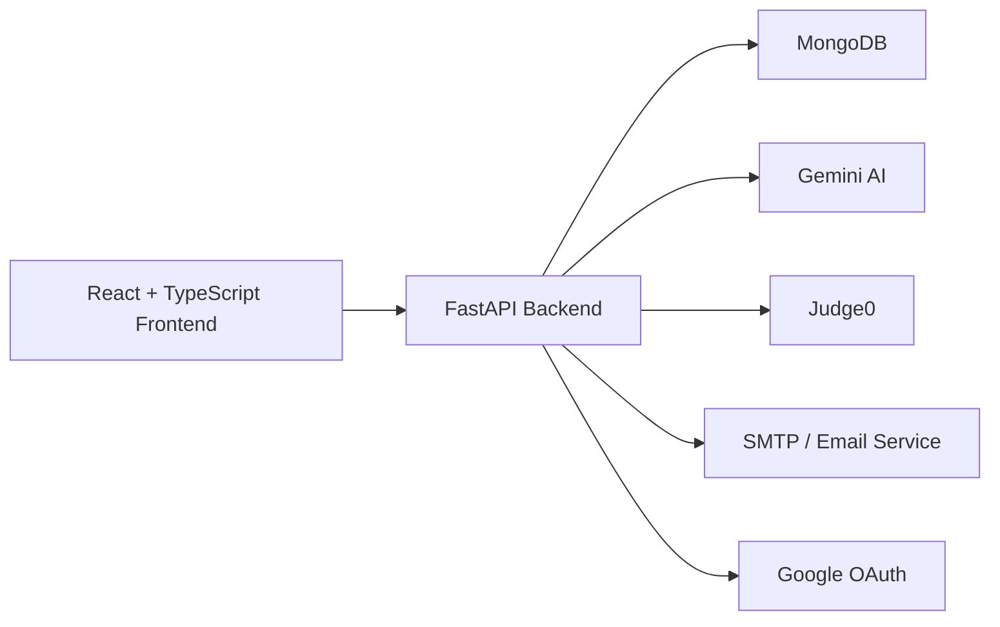
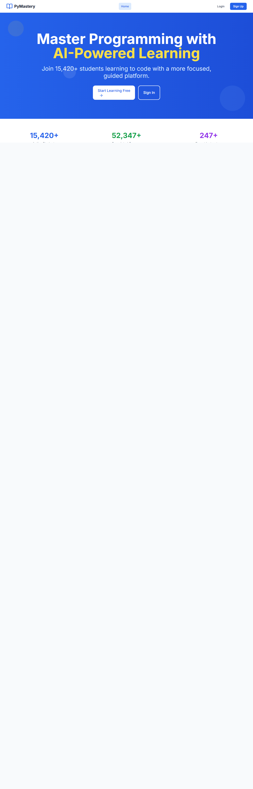
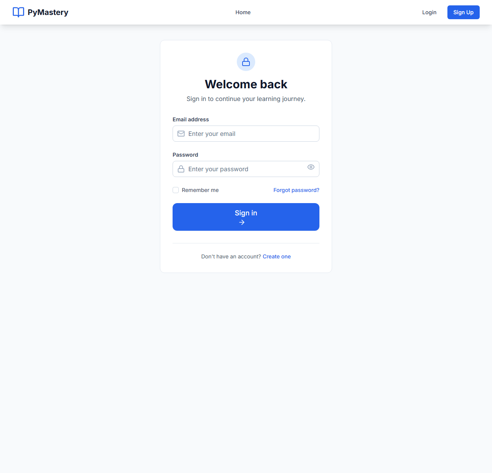
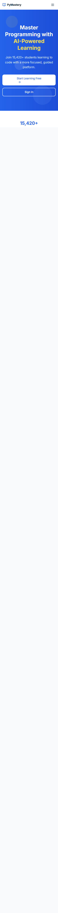
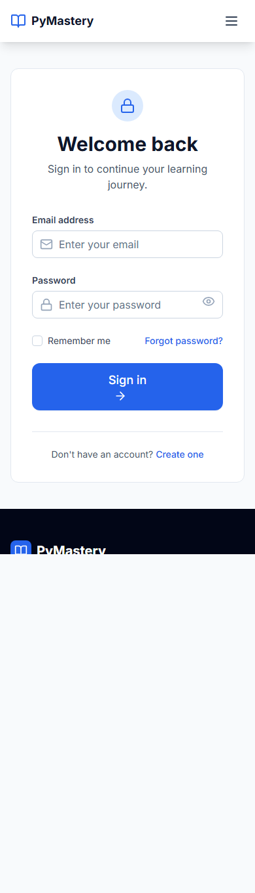

<div align="center">
  <h1>PyMastery</h1>
  <p><strong>Full-stack programming learning platform focused on structured learning, hands-on coding practice, AI guidance, and progress tracking.</strong></p>
  <p>
    
    
    
    
    
    
  </p>
</div>

PyMastery helps students move from learning concepts to solving problems, tracking progress, and getting guided support in one product.

## Overview

PyMastery's main USP is its unified learning workflow. Instead of acting like a static course website, it combines:

- structured course-based learning
- hands-on coding practice
- AI-assisted guidance
- user authentication and protected progress flows
- responsive dashboard-driven learning experience

## Current Status

The repository is in a strong demo and portfolio state.

- Core web flows such as signup, login, logout, protected routes, dashboard, courses, enrollment, and contact are working.
- AI works with live Gemini when provider quota and configuration are available, and otherwise falls back to an explicitly labeled `Demo Mode AI`.
- Code execution works only when a Judge0 service is available. If Judge0 is not reachable, the UI keeps execution clearly disabled instead of pretending it works.
- The repo also contains some legacy and preview-only pages that are not the primary production surface.

## Core Features

- User authentication with JWT-based sessions
- Protected dashboard and profile flows
- Course listing and enrollment
- Coding problem browsing and solve flow
- AI assistant for learning support
- Contact and support flow
- Responsive React frontend for desktop and mobile

## Tech Stack

- Frontend: React, TypeScript, Vite, Tailwind CSS
- Backend: FastAPI, Python
- Database: MongoDB
- Auth: JWT access and refresh tokens
- Testing: Vitest, Playwright, Pytest
- Optional integrations: Google OAuth, Gemini, Judge0, SMTP

## Portfolio Highlights

| Area | Highlight |
| --- | --- |
| Learning Flow | Structured courses, problem-solving, and dashboard-based progress in one app |
| Product Focus | Designed as a complete coding learning workflow, not just a static content site |
| AI Layer | Uses live Gemini when available and clearly falls back to `Demo Mode AI` when it is not |
| Reliability | Protected routes, enrollment flow, contact flow, and verified frontend/backend test setup |

## Architecture



## Resume-Ready Highlights

- Built a full-stack edtech platform using React, TypeScript, FastAPI, and MongoDB.
- Implemented secure authentication, protected routes, course enrollment, dashboard flows, and contact support.
- Integrated AI-assisted tutoring with clear demo-mode fallback behavior when provider limits or configuration block live responses.
- Added production-oriented handling for environment-dependent services such as Judge0, Google OAuth, and email delivery.
- Verified the project using frontend lint/build/tests, UI smoke checks, and backend pytest coverage.

## Project Structure

```text
PyMastery/
|-- backend/        FastAPI backend, auth, APIs, services, database access
|-- frontend/       React frontend, routes, components, pages, tests
|-- mobile-app/     Separate mobile app workspace
|-- docs/           Project documentation and reports
|-- config/         Environment and deployment configuration
|-- judge0/         Judge0-related configuration
\-- scripts/        Utility and verification scripts
```

## Screenshots

Current UI snapshots from the repository.

### Desktop

| Home | Dashboard |
| --- | --- |
|  |  |

| Login | Home Full View |
| --- | --- |
|  |  |

### Mobile

| Home Mobile | Dashboard Mobile |
| --- | --- |
|  |  |

| Login Mobile | Home Mobile Full View |
| --- | --- |
|  |  |

## Future Scope

- Enable fully live AI support without quota-based demo fallback.
- Restore live Judge0-backed execution in environments where the service is available.
- Expand real user progress analytics and reduce remaining sample-data surfaces.
- Continue trimming preview-only and legacy modules to keep the production surface tighter.

## Local Setup

### 1. Backend

```bash
cd backend
python -m venv .venv
.\.venv\Scripts\Activate.ps1
pip install -r requirements.txt
```

Create `backend/.env` from `backend/.env.example`, then start the API:

```bash
python -m uvicorn main:app --host 127.0.0.1 --port 8000
```

### 2. Frontend

```bash
cd frontend
npm install
```

Create `frontend/.env` from `frontend/.env.example`, then start the app:

```bash
npm run dev
```

### 3. Open The App

- Frontend: [http://127.0.0.1:5173](http://127.0.0.1:5173)
- Backend docs: [http://127.0.0.1:8000/docs](http://127.0.0.1:8000/docs)
- Health check: [http://127.0.0.1:8000/api/health](http://127.0.0.1:8000/api/health)

## Required Environment Variables

### Backend

- `JWT_SECRET_KEY`
- `MONGODB_URL`
- `DATABASE_NAME`

### Recommended Backend Variables

- `FRONTEND_URL`
- `ALLOWED_ORIGINS`
- `EMAIL_FROM`
- `SUPPORT_EMAIL`

### Optional Integrations

- Google OAuth: `GOOGLE_CLIENT_ID`, `GOOGLE_CLIENT_SECRET`, `GOOGLE_REDIRECT_URI`
- Gemini: `GEMINI_API_KEY`, `GEMINI_MODEL`
- Judge0: `JUDGE0_API_URL`, `JUDGE0_API_KEY`, `JUDGE0_HOST`
- Email/SMTP: `SMTP_HOST` or `SMTP_SERVER`, `SMTP_PORT`, `SMTP_USERNAME` or `SMTP_USER`, `SMTP_PASSWORD`

## Testing

### Frontend

```bash
cd frontend
npm run lint
npm run build
npm run test
npm run test:ui-smoke
```

### Backend

```bash
cd backend
pytest -q
```

## Notes

- Do not commit `.env` files or secret keys.
- If Gemini is unavailable, the app will show `Demo Mode AI`.
- If Judge0 is unavailable, code execution stays disabled with a clear user-facing message.
- If email or OAuth are not configured, the app degrades gracefully and reports that status honestly.

## Documentation

- [Docs Index](./docs/README.md)
- [API Docs Guide](./docs/API.md)
- [Deployment Guide](./docs/DEPLOYMENT.md)
- [Project Structure](./docs/PROJECT_STRUCTURE.md)
