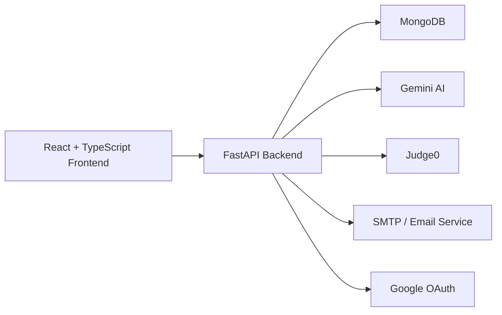
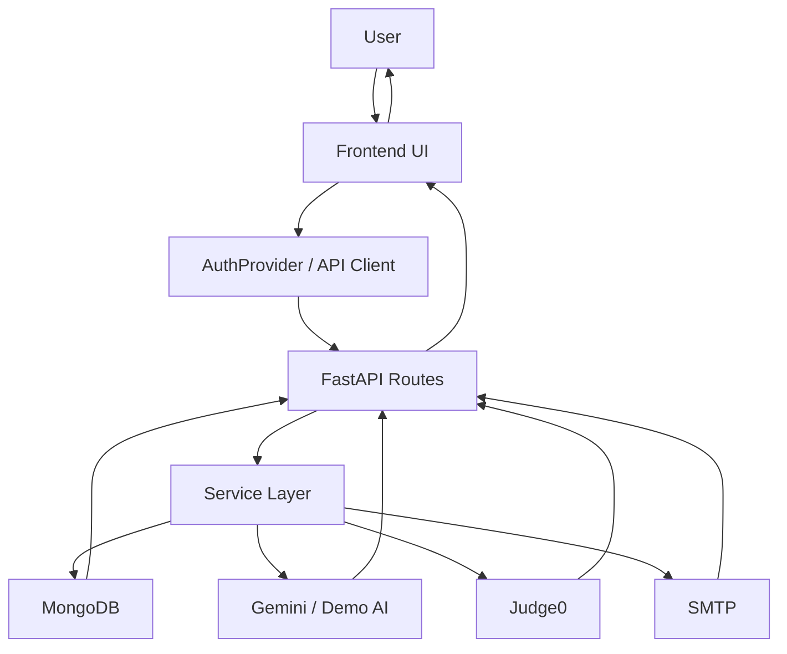
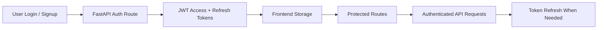

<div align="center">
  <h1>🚀 PyMastery</h1>
  <p><strong>Full-stack programming learning platform for structured learning, hands-on coding practice, AI guidance, and progress tracking.</strong></p>
  <p>Learn concepts, solve problems, enroll in courses, track growth, and get guided support in one product.</p>
  <p>
    <a href="#-overview">Overview</a> •
    <a href="#-feature-status">Feature Status</a> •
    <a href="#-system-architecture">Architecture</a> •
    <a href="#-data-flow-diagram">Data Flow</a> •
    <a href="#-local-setup">Setup</a> •
    <a href="#-testing--verification">Testing</a>
  </p>
  <p>
    
    
    
    
    
    
  </p>
</div>

> PyMastery is designed as a complete coding learning workflow, not just a static course website.

## 📌 Overview

PyMastery is a full-stack edtech platform built to make programming education more practical, structured, and product-driven. Instead of separating lessons, coding practice, guidance, and progress tracking across multiple tools, PyMastery brings them together in a single application.

Its core value lies in the full learner journey:

- learn concepts through structured course flows
- practice through coding problems and solve pages
- get support through an AI assistant
- track progress through dashboard-driven user flows
- interact with a product experience instead of a static content page

## ✨ What Makes It Different

- It combines learning, practice, AI help, and progress tracking in one system.
- It keeps environment-dependent features honest instead of pretending everything is live.
- It is built like a real full-stack product with protected routes, APIs, persistence, and verification flows.
- It is portfolio-friendly because the architecture, flows, and integrations are visible and explainable.

## ✅ Current Status

The repository is currently in a strong **demo-ready** state.

- Core flows such as signup, login, logout, protected routes, dashboard, courses, enrollment, and contact are working.
- The AI assistant uses live Gemini when available and falls back to clearly labeled `Demo Mode AI` when it is not.
- Code execution depends on Judge0. If Judge0 is unavailable, execution is kept clearly disabled.
- Some legacy and preview-only surfaces still exist in the repository, but they are not the main production-facing path.

## 🎯 Feature Status

| Feature | What It Does | Status |
| --- | --- | --- |
| Authentication | Signup, login, logout, protected access, token-based sessions | Working |
| Dashboard | Central learning overview and activity surface | Working |
| Courses | Course listing, course detail, and enrollment flow | Working |
| Problems | Coding problem browsing and solve flow | Working |
| AI Assistant | In-app tutor support and guided responses | Demo Mode or Working, depending on Gemini availability |
| Code Execution | Runtime execution for coding problems | Disabled unless Judge0 is available |
| Contact Flow | Contact/support submission flow | Working |
| Google OAuth | Optional sign-in with Google | Environment-dependent |
| Email / SMTP | Password reset, verification, and mail delivery flows | Environment-dependent |

## 🛠️ Tech Stack

| Layer | Stack |
| --- | --- |
| Frontend | React, TypeScript, Vite, Tailwind CSS |
| Backend | FastAPI, Python |
| Database | MongoDB |
| Authentication | JWT access and refresh tokens |
| Testing | Vitest, Playwright, Pytest |
| Integrations | Gemini, Judge0, Google OAuth, SMTP |

## 🌟 Portfolio Highlights

| Area | Highlight |
| --- | --- |
| Product Thinking | Built as a complete coding learning workflow rather than a static course page |
| Full-Stack Scope | Covers frontend, backend, auth, APIs, database, and external integrations |
| Reliability | Honest handling of demo-mode and disabled states for unavailable services |
| Verification | Frontend lint/build/tests, UI smoke checks, and backend pytest coverage are part of the workflow |

## 🧩 System Architecture



## 🔄 Data Flow Diagram



## 🔐 Authentication Flow



## 📄 Resume-Ready Highlights

- Built a full-stack edtech platform using React, TypeScript, FastAPI, and MongoDB.
- Implemented secure authentication, protected routes, course enrollment, dashboard flows, and contact support.
- Integrated AI-assisted tutoring with clear fallback handling when provider limits or configuration block live responses.
- Added production-oriented behavior for environment-dependent services such as Judge0, Google OAuth, and email delivery.
- Verified the project using frontend lint/build/tests, UI smoke checks, and backend pytest.

## 📁 Project Structure

```text
PyMastery/
|-- backend/        FastAPI backend, auth, APIs, services, database access
|-- frontend/       React frontend, routes, components, pages, tests
|-- mobile-app/     Separate mobile app workspace
|-- docs/           Project documentation and reports
|-- config/         Environment and deployment configuration
|-- judge0/         Judge0-related configuration
\-- scripts/        Utility and verification scripts
```

## 📸 Screenshot Placeholder

If you want to showcase the UI later, add your final screenshots and replace the paths in the template below.

### Recommended Screenshot Set

| Screen | Suggested File Name |
| --- | --- |
| Home Page | `docs/screenshots/home.png` |
| Dashboard | `docs/screenshots/dashboard.png` |
| Course Page | `docs/screenshots/course-page.png` |
| Problems Page | `docs/screenshots/problems.png` |
| AI Assistant | `docs/screenshots/ai-chat.png` |
| Mobile View | `docs/screenshots/mobile-view.png` |

<details>
  <summary><strong>Ready-to-use screenshot section template</strong></summary>

```md
## 📸 Product Preview

### Main Screens

| Home | Dashboard |
| --- | --- |
|  |  |

| Courses | Problems |
| --- | --- |
|  |  |

### Feature Highlights

| AI Assistant | Mobile View |
| --- | --- |
|  |  |
```

</details>

## ⚙️ Local Setup

### 1. Backend

```powershell
cd backend
python -m venv .venv
.\.venv\Scripts\Activate.ps1
pip install -r requirements.txt
```

Create `backend/.env` from `backend/.env.example`, then start the API:

```powershell
python -m uvicorn main:app --host 127.0.0.1 --port 8000
```

### 2. Frontend

```powershell
cd frontend
npm install
```

Create `frontend/.env` from `frontend/.env.example`, then start the app:

```powershell
npm run dev
```

### 3. Open The App

- Frontend: [http://127.0.0.1:5173](http://127.0.0.1:5173)
- Backend docs: [http://127.0.0.1:8000/docs](http://127.0.0.1:8000/docs)
- Health check: [http://127.0.0.1:8000/api/health](http://127.0.0.1:8000/api/health)

## 🔐 Environment Configuration

### Required Backend Variables

- `JWT_SECRET_KEY`
- `MONGODB_URL`
- `DATABASE_NAME`

### Recommended Backend Variables

- `FRONTEND_URL`
- `ALLOWED_ORIGINS`
- `EMAIL_FROM`
- `SUPPORT_EMAIL`

### Optional Integrations

- Google OAuth: `GOOGLE_CLIENT_ID`, `GOOGLE_CLIENT_SECRET`, `GOOGLE_REDIRECT_URI`
- Gemini: `GEMINI_API_KEY`, `GEMINI_MODEL`
- Judge0: `JUDGE0_API_URL`, `JUDGE0_API_KEY`, `JUDGE0_HOST`
- Email / SMTP: `SMTP_HOST` or `SMTP_SERVER`, `SMTP_PORT`, `SMTP_USERNAME` or `SMTP_USER`, `SMTP_PASSWORD`

## 🧪 Testing & Verification

### Frontend

```powershell
cd frontend
npm run lint
npm run build
npm run test
npm run test:ui-smoke
```

### Backend

```powershell
cd backend
pytest -q
```

## 📝 Notes

- Do not commit `.env` files or secret keys.
- If Gemini is unavailable, the app shows `Demo Mode AI`.
- If Judge0 is unavailable, code execution stays disabled with a clear user-facing message.
- If email or OAuth are not configured, the app degrades gracefully and reports that state honestly.

## 🔮 Future Scope

- Enable fully live AI support without quota-based demo fallback.
- Restore live Judge0-backed execution in environments where the service is available.
- Expand real user progress analytics and reduce remaining sample-data surfaces.
- Continue trimming preview-only and legacy modules to keep the production surface tighter.

## 📚 Documentation

- [Docs Index](./docs/README.md)
- [API Docs Guide](./docs/API.md)
- [Deployment Guide](./docs/DEPLOYMENT.md)
- [Project Structure](./docs/PROJECT_STRUCTURE.md)
